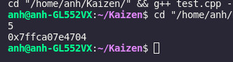

# Pointer

## Virtual memory & Physical memory

chúng ta không thể làm việc trực tiếp đối với bộ nhớ của máy tính (physical) mà phải thông qua bước trung gian đó là thông qua một bộ nhớ ảo (virtual memory).

Physical memory phụ thuộc vào bộ nhớ của RAM còn Virtual memory phụ thuộc vào cả bộ nhớ trong của máy tính do đó virtual memory có kích thước lớn hơn physical memory, giúp chạy được các chương trình cần bộ nhớ lớn.

Ở con trỏ ta có thể hiểu rằng, biến khởi tạo là vùng nhớ ảo chứa địa chỉ tại vùng nhớ vật lý.

cách khai báo con trỏ: 

```c++
int *x;
```

với cú pháp <kiểu dữ lieu> *<tên biến>

Đối với 1 biến bình thường ta có thể xuất ra địa chỉ của biến đó bằng cách:

```c++
 int x=5; 
 cout<<x<<'\n';//in ra gia tri cua bien 
 cout<<&x<<'\n';//in ra dia chi cua bien
```



Bằng cách thêm dấu "&" ta có thể xuất địa chỉ của biến ở vùng nhớ vật lý cách này gọi là address-of operator

lưu ý ta chỉ có thể lưu vào con trỏ địa chỉ của vùng nhớ, tức là không thể lưu giá trị, kể cả địa chỉ dưới dạng thập lục phân cũng không thể lưu vd như: 

```c++
int *x;
int a=10;
x=&a;
```

Đây là 1 cách gán hợp lệ.

```c++
int *x;
x=10;
```

```c++
int *x;
x=0012FF7c;
```

cả hai cách trên đều sai!

Ta cũng có thể  gán địa chỉ của 2 con trỏ với nhau.

```c++
int *con_tro1, *con_tro2;
int number=10;
con_tro1=&number;
con_tro2=con_tro1;
cout <<con_tro1<<endl;
cout<<con_tro2;
```

Kết quả sẽ là địa chỉ của number gán cho con trỏ 1 và 2;

với mảng thì các thành phần trong mảng sẽ lưu ở những địa chỉ khác nhau tuy nhiên chúng lại liền kề nhau

LƯU Ý: chúng ta chỉ có thể gán địa chỉ cho con trỏ khi địa chỉ bên trong cùng kiểu dữ liệu với con trỏ 


Nếu ta khai báo khác kiểu thì compiler sẽ phân tích sai số lượng bytes và từ đó đưa gia giá trị của vùng nhớ.

Cách thức để lấy giá trị từ con trỏ ta sử dụng cú pháp: *<địa chỉ>

```c++
int *x;
int number=5;
x=&number;
cout<<*x<<endl>>;
cout<<*(&number);
```

cả hai cách trên đều đúng và cho ra giá trị là 5

Nếu chúng ta không lưu địa chỉ cho con trỏ thì nó sẽ lưu vào 1 giá trị rác. Điều này rất nguy hiểm cho chương trình của bạn do nó có thể là 1 vùng nhớ của ứng dụng nào đó và gây ảnh hưởng cho máy tính của bạn. Do đó chúng ta cần phải gán giá trị cho nó:

```c++
#define NULL 0

int *x= NULL;
```

Ngoài ra ở c++11 đã có tích hợp cho chúng ta.

```c++
int *x=nullptr;
```